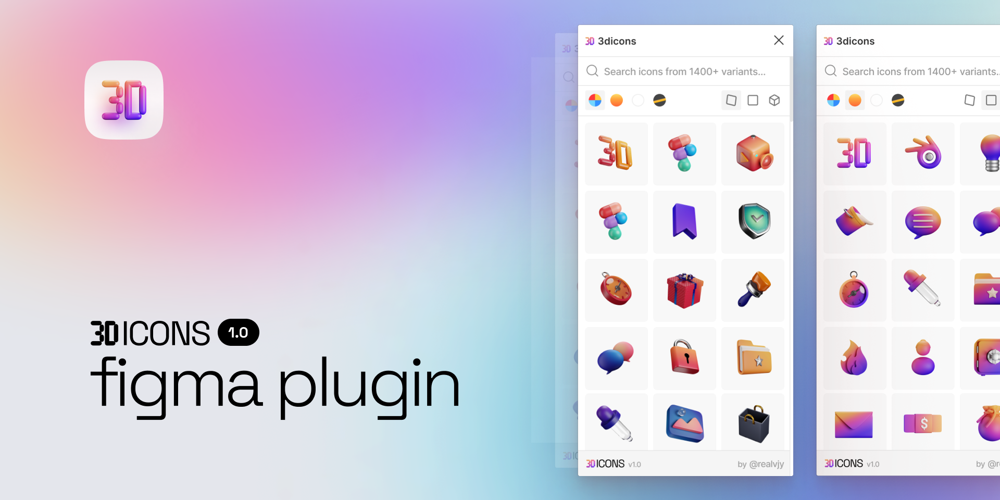

[](https://www.figma.com/community/plugin/1107546399747513238/3dicons)

# 3dicons Figma plugin

Use 1400+ [3dicons](https://3dicons.co) within Figma or Figjam files quickly. The icons can be searched and filtered by color and angle.

## Figma Community

Grab community file from 👉 here [Figma Community](https://www.figma.com/community/plugin/1107546399747513238/3dicons)


## Local development

Plugin is opensource. You are welcome to contribute.

1. Clone the repository

   ```shell
   git clone
   cd 3dicons-figma
   ```

1. Install the dependencies

   ```shell
   yarn
   ```

1. Build the plugin

   ```
   yarn watch
   ```

1. Open the [Figma desktop app](https://www.figma.com/downloads/)

1. Go to `Menu > Plugins > Development > Import Plugin from manifest...`

1. Choose `3dicons-plugin/manifest.json`

1. Run the plugin by going to `Menu > Plugins > Development > 3dicons`

## Support & Donate

The goal of this project is to contribute to the open design community. Even though I do not intend to charge for these community resources, if 3dicons has ever been useful to you or your team, I would appreciate your support! It helps to maintain server costs and keep it grow. More details about the project [3dicons.co/about](https://3dicons.co/about/)

[Github sponsor](https://github.com/sponsors/realvjy) | [Buy me a coffee](https://buymeacoffee.com/realvjy)

## Say hi or Feedback

Feel free to tag me or say hi on Twitter ([@realvjy](http://twitter.com/realvjy)). You are also welcome to share your feedback or bug reports 🙏

Website: [3dicons.co](https://3dicons.co)